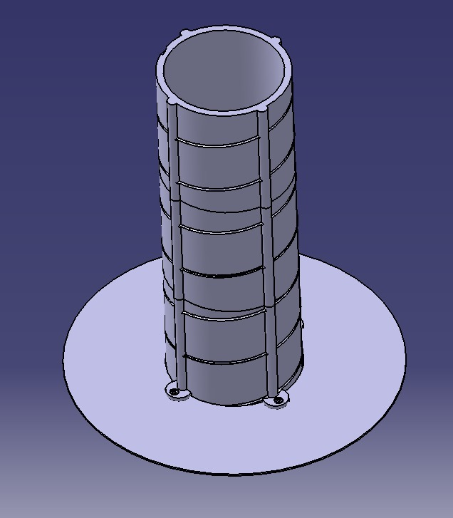

Antenna Helical 1.3 Ghz
===============
**Please note: This thing is part of a list that was [automatically generated](https://github.com/carlosgs/export-things) and may have been updated since then. Make sure to check for the current license and authorship.**  

Antenna Helical 1.3 Ghz  by pando85 , published Feb 24, 2014

Description
--------
Antenna Helical 1.3 Ghz   
 
<a href="http://www.aeromodelismovirtual.com/showthread.php?t=14289" target="_blank" rel="nofollow">aeromodelismovirtual.com/showthread.php?t=14289</a>

Instructions
--------
None

Files
--------

 [ Antena_Helical.stl](Antena_Helical.stl)  

 [ Parabola_Helical_.stl](Parabola_Helical_.stl)  

Pictures
--------

Tags
--------
antenna  

  

License
--------
Antenna Helical 1.3 Ghz by pando85 is licensed under the Attribution - Non-Commercial - Share Alike license.  

By: Alexander Gil Casas (pando85)
--------
 