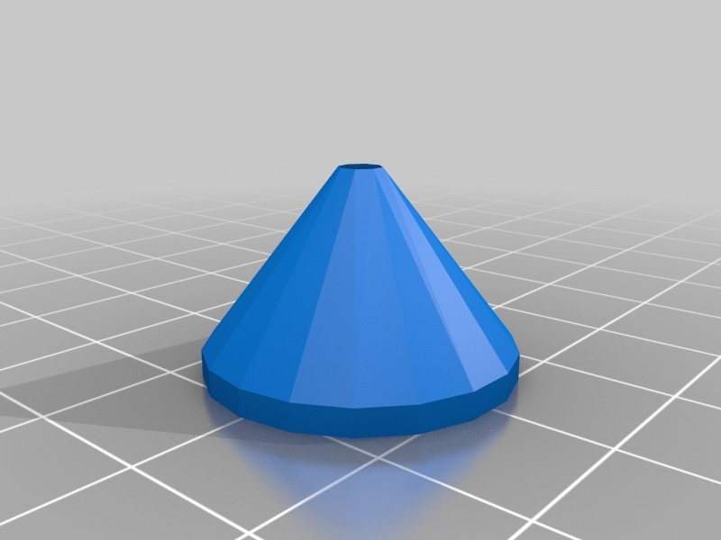
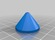

Cone for propeller balancer
===============
**Please note: This thing is part of a list that was [automatically generated](https://github.com/carlosgs/export-things) and may have been updated since then. Make sure to check for the current license and authorship.**  

Cone for propeller balancer  by pando85 , published Mar 2, 2014

Description
--------
Cones 3mm of diameter. With this and an old motor with 3mm diameter I balance my props.

Instructions
--------
None

Files
--------

 [ Cone.stl](Cone.stl)  

Tags
--------
None  

  

License
--------
Cone for propeller balancer by pando85 is licensed under the Attribution - Non-Commercial - Share Alike license.  

By: Alexander Gil Casas (pando85)
--------
 