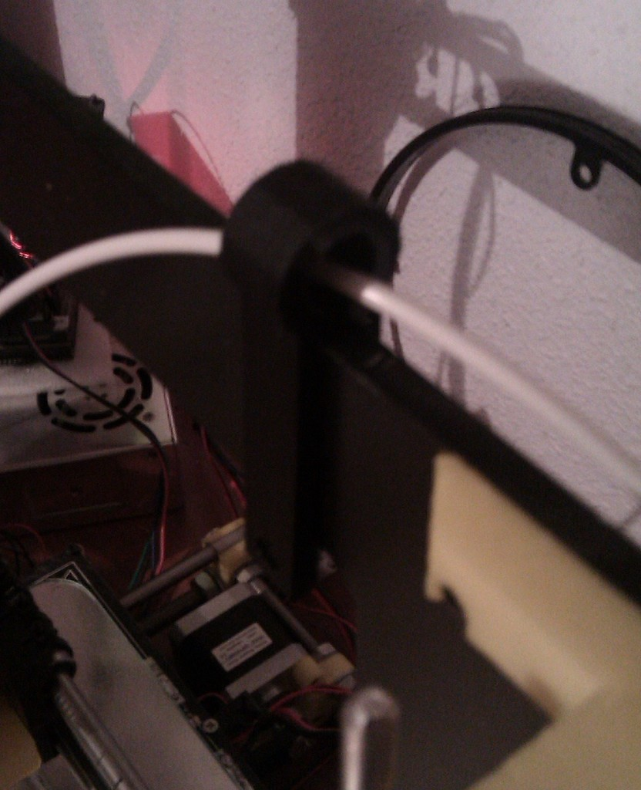
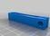
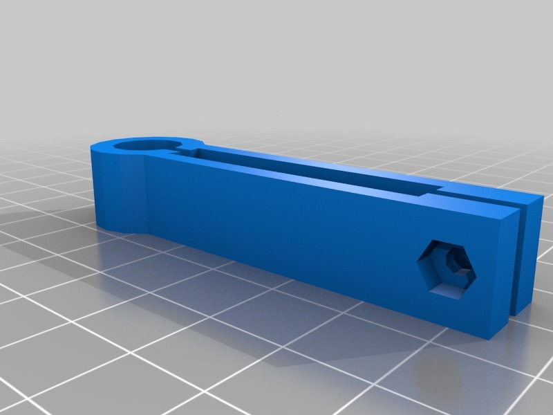

Filament Guide for Prusa i3
===============
**Please note: This thing is part of a list that was [automatically generated](https://github.com/carlosgs/export-things) and may have been updated since then. Make sure to check for the current license and authorship.**  

Filament Guide for Prusa i3  by pando85 , published Feb 20, 2014

Description
--------
It's a remix of <a href="http://www.thingiverse.com/thing:128232" target="_blank" rel="nofollow">thingiverse.com/thing:128232</a> with a screw to fix it.

Instructions
--------
None

Files
--------

 [ Filament_Guide.CATPart](Filament_Guide.CATPart)  

 [ Filament_Guide.stl](Filament_Guide.stl)  

Pictures
--------

Tags
--------
None  

  

License
--------
Filament Guide for Prusa i3 by pando85 is licensed under the Attribution - Non-Commercial - Share Alike license.  

By: Alexander Gil Casas (pando85)
--------
 