HD Wing II Camera holder
===============
**Please note: This thing is part of a list that was [automatically generated](https://github.com/carlosgs/export-things) and may have been updated since then. Make sure to check for the current license and authorship.**  

HD Wing II Camera holder  by pando85 , published Feb 24, 2014

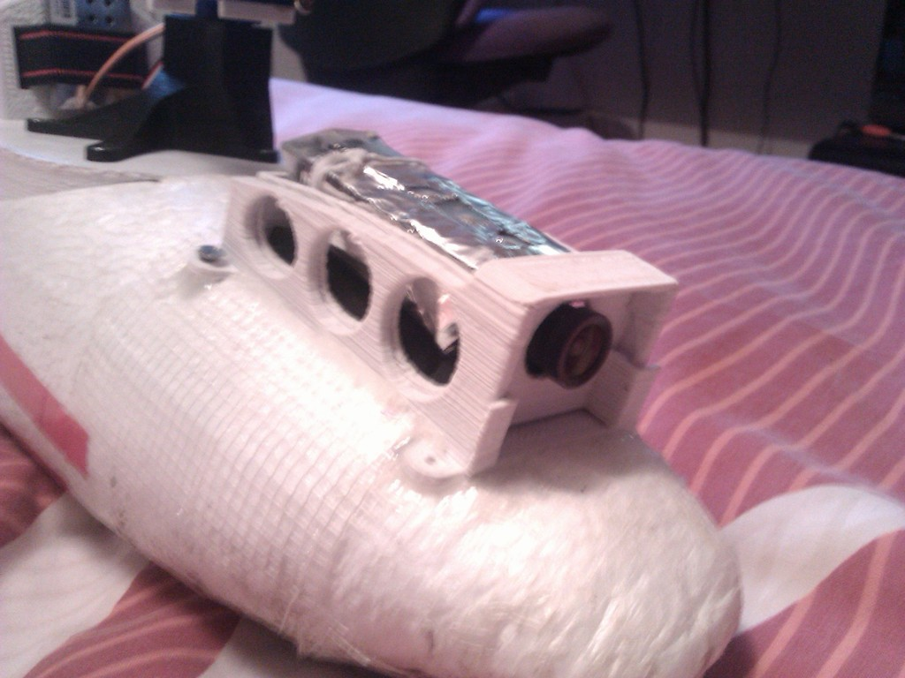

Description
--------
It is a support for HD WING II camera.   

Instructions
--------
None

Files
--------
[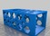](Out_boxV2.stl)
 [ Out_boxV2.stl](Out_boxV2.stl)  

[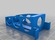](In_boxV2.stl)
 [ In_boxV2.stl](In_boxV2.stl)  

[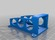](Out_boxV2.2L.stl)
 [ Out_boxV2.2L.stl](Out_boxV2.2L.stl)  

[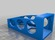](Out_boxV2.3L.stl)
 [ Out_boxV2.3L.stl](Out_boxV2.3L.stl)  

Pictures
--------
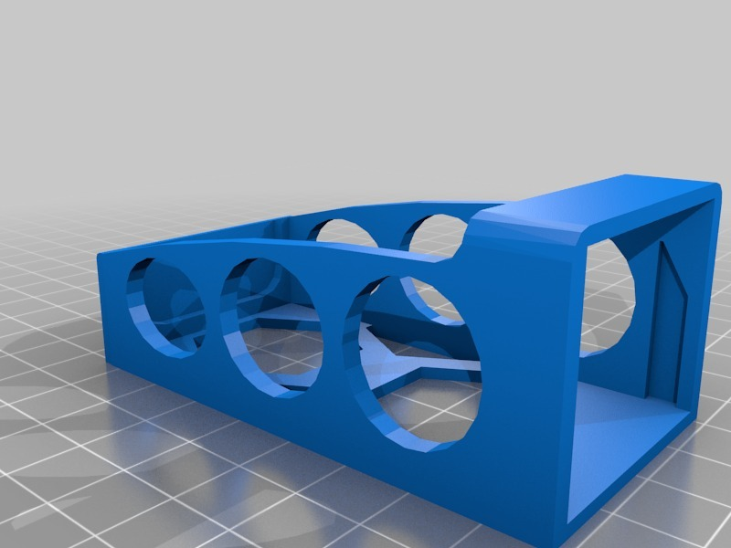
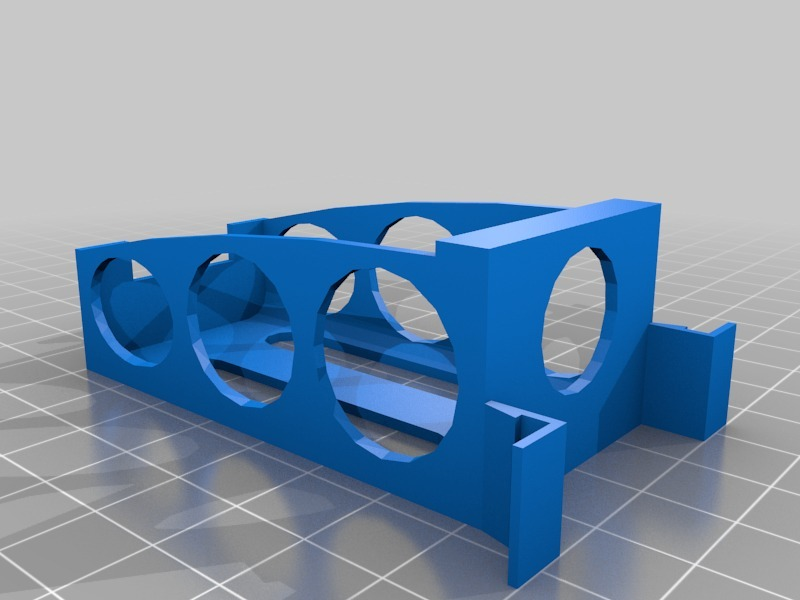
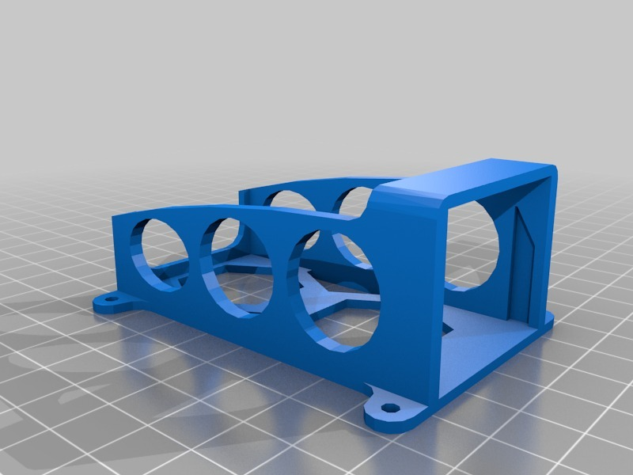
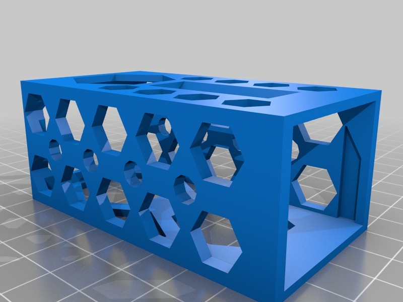
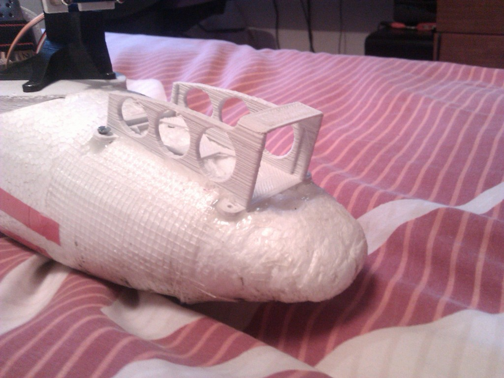
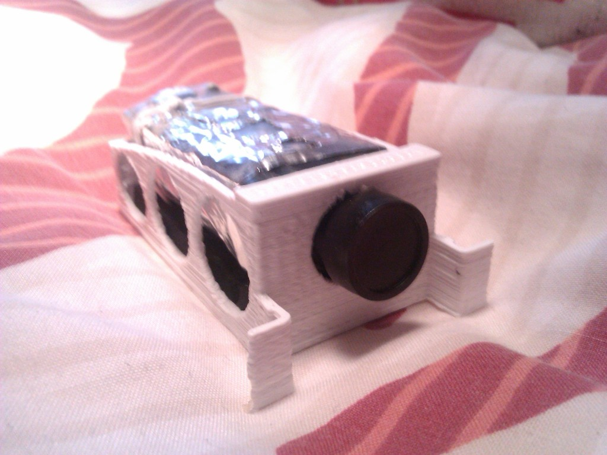

Tags
--------
None  

  

License
--------
HD Wing II Camera holder by pando85 is licensed under the Attribution - Non-Commercial - Share Alike license.  

By: Alexander Gil Casas (pando85)
--------
 