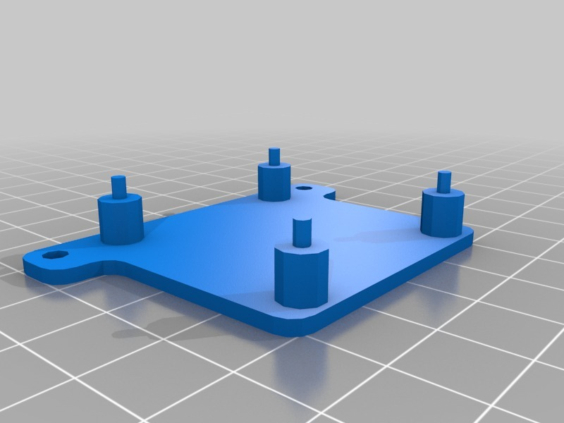
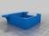
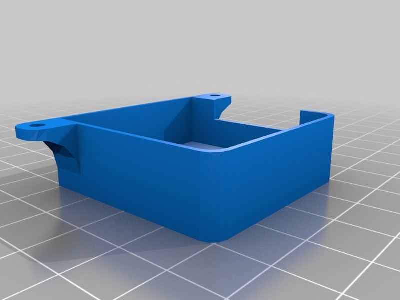

Holder for NEO-6M APM GPS with compass
===============
**Please note: This thing is part of a list that was [automatically generated](https://github.com/carlosgs/export-things) and may have been updated since then. Make sure to check for the current license and authorship.**  

Holder for NEO-6M APM GPS with compass  by pando85 , published Apr 18, 2014

Description
--------
Holder for NEO-6M APM GPS with compass.   
 
Tested and working.    
 
I will upload a picture.

Instructions
--------
None

Files
--------

 [ GPS_holder.stl](GPS_holder.stl)  

 [ GPS_top.stl](GPS_top.stl)  

Pictures
--------

Tags
--------
None  

  

License
--------
Holder for NEO-6M APM GPS with compass by pando85 is licensed under the Attribution - Non-Commercial - Share Alike license.  

By: Alexander Gil Casas (pando85)
--------
 