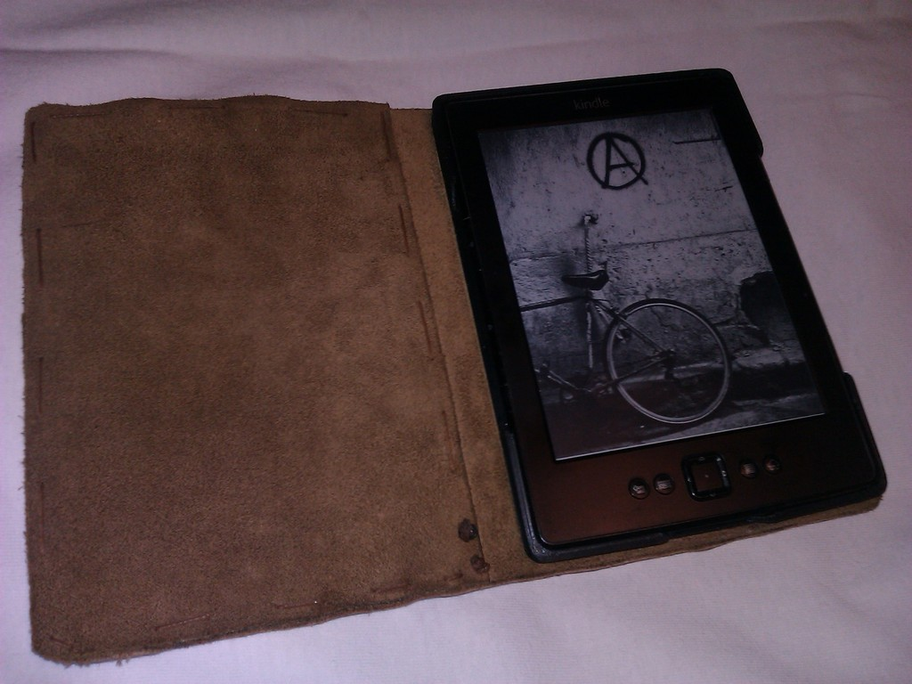
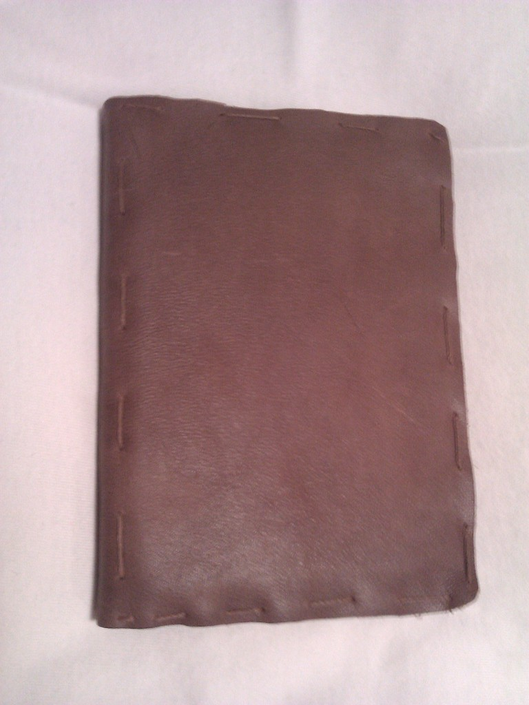
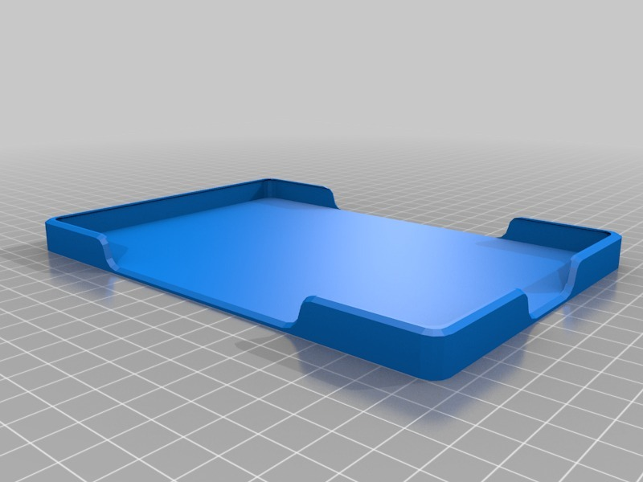

Kindle 4 case
===============
**Please note: This thing is part of a list that was [automatically generated](https://github.com/carlosgs/export-things) and may have been updated since then. Make sure to check for the current license and authorship.**  

Kindle 4 case  by pando85 , published Oct 23, 2013

Description
--------
A case for my Kindle 4.    
 
I glued some leather with a cartoon in the middle to do it stronger.

Instructions
--------
None

Files
--------

 [ FundaKindle.stl](FundaKindle.stl)  

Pictures
--------

Tags
--------
None  

  

License
--------
Kindle 4 case by pando85 is licensed under the Attribution - Non-Commercial - Share Alike license.  

By: Alexander Gil Casas (pando85)
--------
 