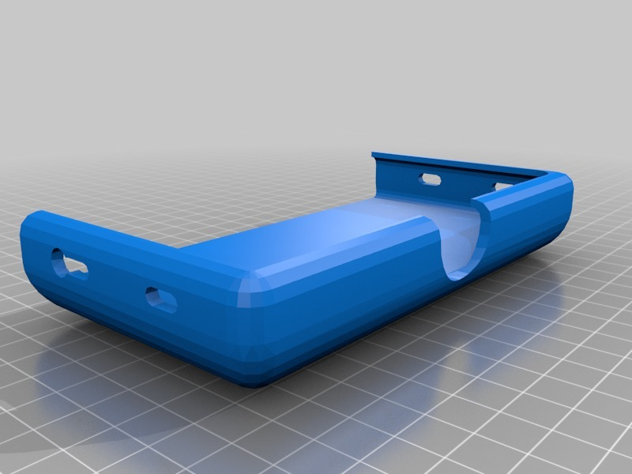
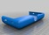
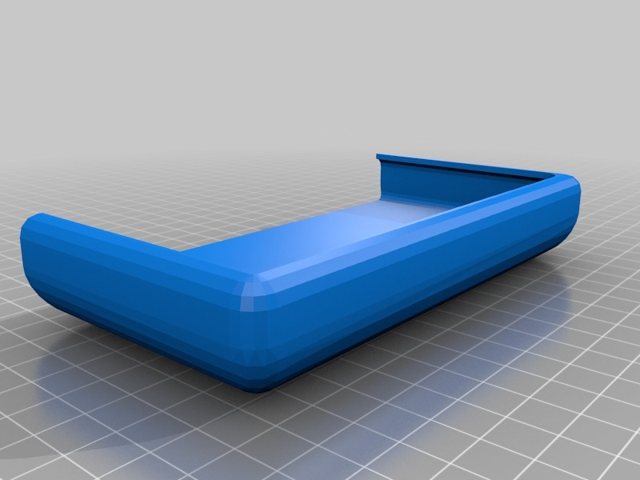

LG G2 Car Holder
===============
**Please note: This thing is part of a list that was [automatically generated](https://github.com/carlosgs/export-things) and may have been updated since then. Make sure to check for the current license and authorship.**  

LG G2 Car Holder  by pando85 , published Apr 30, 2014

Description
--------
Two differents car holders to hold your mobile phone in air duct with two bridles.

Instructions
--------
None

Files
--------

 [ LG_G2_holder.stl](LG_G2_holder.stl)  

 [ LG_G2_holder_V2.stl](LG_G2_holder_V2.stl)  

Pictures
--------

Tags
--------
None  

  

License
--------
LG G2 Car Holder by pando85 is licensed under the Attribution - Non-Commercial - Share Alike license.  

By: Alexander Gil Casas (pando85)
--------
 