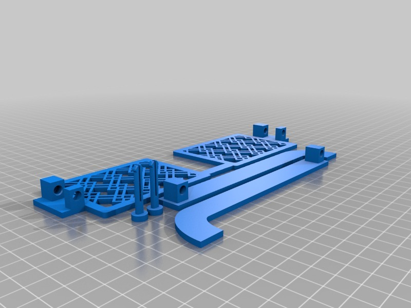
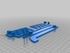

My Customized Glasses w/ Fillable Lenses
===============
**Please note: This thing is part of a list that was [automatically generated](https://github.com/carlosgs/export-things) and may have been updated since then. Make sure to check for the current license and authorship.**  

My Customized Glasses w/ Fillable Lenses  by pando85 , published Oct 23, 2013

Description
--------
Customized version of <a href="http://www.thingiverse.com/thing:56864" target="_blank" rel="nofollow">thingiverse.com/thing:56864</a> 
 
Created with Customizer! <a href="http://www.thingiverse.com/apps/customizer/run?thing_id=56864" target="_blank" rel="nofollow">thingiverse.com/apps/customizer/run?thing_id=56864</a> 
 

Instructions
--------
Using the following options: 
 
Overall_Glasses_Width = 115 
Height_of_Frame = 59 
Depth_of_Glasses = 3 
Width_of_Nose_Bridge = 25 
Pattern_Line_Thickness = 10 
Pattern_Radius_Modifier = 22 
Height_of_Hook_Curve = 30 
Pattern_Infill_Type = 4 
shape = square 
Pattern_Radius = 11 
Thickness_of_Frame = 5 
Height_of_Nose_Bridge = 7 
Length_of_Hook_Curve = 23 
Temple_Length = 125 

Files
--------

 [ glasses_20131023-26144-1iu9wz7-0.stl](glasses_20131023-26144-1iu9wz7-0.stl)  

Tags
--------
customized  

  

License
--------
My Customized Glasses w/ Fillable Lenses by pando85 is licensed under the Creative Commons - Attribution - Share Alike license.  

By: Alexander Gil Casas (pando85)
--------
 