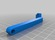

NA-771 holder for Turnigy 9xr
===============
**Please note: This thing is part of a list that was [automatically generated](https://github.com/carlosgs/export-things) and may have been updated since then. Make sure to check for the current license and authorship.**  

NA-771 holder for Turnigy 9xr  by pando85 , published Dec 28, 2013

Description
--------
Holder for antenna Nagoya 771 to install in Turnigy 9xr with pigtail.   
 
This support allow you using antenna totally vertical.   
 
There are two version for arms.    
 
V2: photografic version.   
V2_shorter: Antenna is nearer from handle of Turnigy 9xr.   
 
I think a SMA 15cm pigtail can handle easy V2_shorter, larger version will try it.   
 
All screws are M3.   
 
Tested and working.    
 
 
Last Update: 31-12-2013.

Instructions
--------
None

Files
--------

 [ Soporte_Largo.stl](Soporte_Largo.stl)  

 [ Symmetry_of_BrazoV2.stl](Symmetry_of_BrazoV2.stl)  

 [ BrazoV2.stl](BrazoV2.stl)  

 [ BrazoV2_shorter.stl](BrazoV2_shorter.stl)  

 [ Symmetry_of_BrazoV2_shorten.stl](Symmetry_of_BrazoV2_shorten.stl)  

 [ Soporte_Corto.stl](Soporte_Corto.stl)  

Pictures
--------

Tags
--------
None  

  

License
--------
NA-771 holder for Turnigy 9xr by pando85 is licensed under the Attribution - Non-Commercial - Share Alike license.  

By: Alexander Gil Casas (pando85)
--------
 