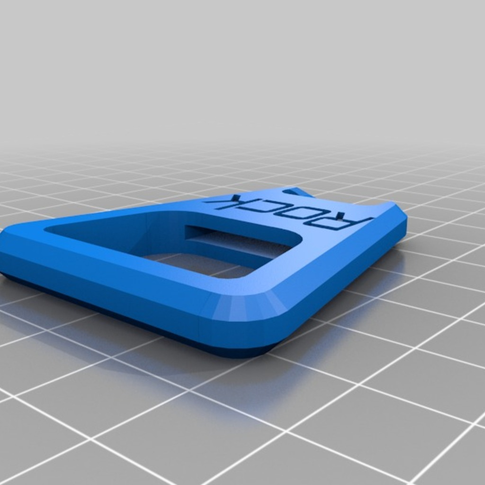
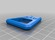

Rock Bottle Opener
===============
**Please note: This thing is part of a list that was [automatically generated](https://github.com/carlosgs/export-things) and may have been updated since then. Make sure to check for the current license and authorship.**  

Rock Bottle Opener  by pando85 , published Dec 5, 2013

Description
--------
Customized version of <a href="http://www.thingiverse.com/thing:139461" target="_blank" rel="nofollow">thingiverse.com/thing:139461</a> 
 
Created with Customizer! <a href="http://www.thingiverse.com/apps/customizer/run?thing_id=139461" target="_blank" rel="nofollow">thingiverse.com/apps/customizer/run?thing_id=139461</a> 
 

Instructions
--------
Using the following options: 
 
Font = write/orbitron.dxf 
RowSpacing = 0 
Text = Rock 
ManualThickness = 1.75 
TextRelief = -10 
TextPositionY = 0 
TextPositionX = -30 
NumberOfRows = 1 
CoinType = EU 
ColumnSpacing = 0 
ManualRadius = 9.5 
build_plate_manual_y = 100 
build_plate_manual_x = 100 
NumberOfColumns = 1 
TextHieght = 90 
ManualOverhang = 3 
build_plate_selector = 0 
TextSpacing = 10 

Files
--------

 [ pennyopener_20131205-26144-gk9qvs-0.stl](pennyopener_20131205-26144-gk9qvs-0.stl)  

Tags
--------
customized  

  

License
--------
Rock Bottle Opener by pando85 is licensed under the Creative Commons - Attribution - Share Alike license.  

By: Alexander Gil Casas (pando85)
--------
 