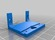
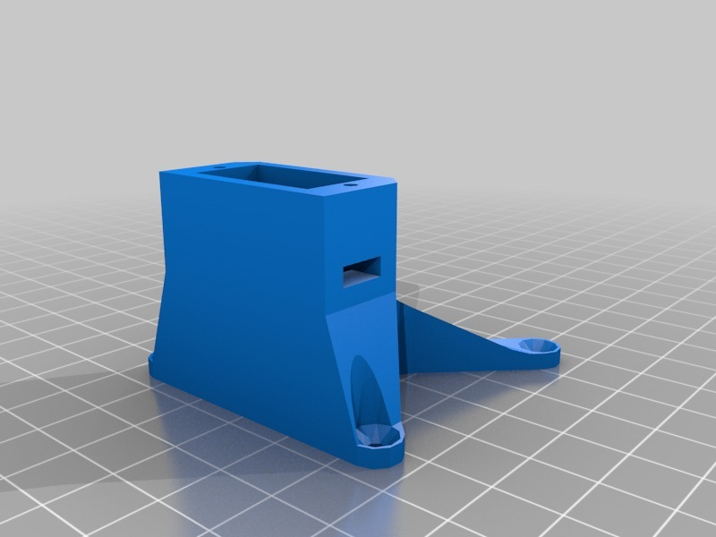

Simple FPV Pan and Tilt
===============
**Please note: This thing is part of a list that was [automatically generated](https://github.com/carlosgs/export-things) and may have been updated since then. Make sure to check for the current license and authorship.**  

Simple FPV Pan and Tilt  by pando85 , published Feb 24, 2014

Description
--------
Simple FPV pan and tilt.   
 
Valid for a SONY CCD camera.

Instructions
--------
None

Files
--------

 [ Soporte_Camara.stl](Soporte_Camara.stl)  

 [ Soporte_PanTilt.stl](Soporte_PanTilt.stl)  

 [ Servo_holder.stl](Servo_holder.stl)  

Pictures
--------

Tags
--------
None  

  

License
--------
Simple FPV Pan and Tilt by pando85 is licensed under the Attribution - Non-Commercial - Share Alike license.  

By: Alexander Gil Casas (pando85)
--------
 