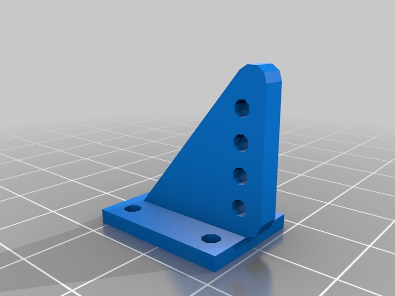

Strong Horn
===============
**Please note: This thing is part of a list that was [automatically generated](https://github.com/carlosgs/export-things) and may have been updated since then. Make sure to check for the current license and authorship.**  

Strong Horn  by pando85 , published May 8, 2014

Description
--------
Aeromodelism control horn.   
 
It's strong thinking in controling a flying wing about 2kg of weight.

Instructions
--------
Print 0.1mm layer height and 0.6 infill

Files
--------

 [ Horn.stl](Horn.stl)  

 [ Horn_top.stl](Horn_top.stl)  

Pictures
--------

Tags
--------
aeromodel , control , h , horn  

  

License
--------
Strong Horn by pando85 is licensed under the Attribution - Non-Commercial - Share Alike license.  

By: Alexander Gil Casas (pando85)
--------
 