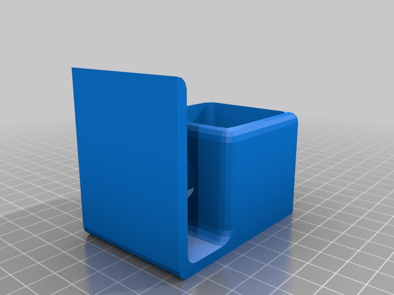

Support for Lipo discharger
===============
**Please note: This thing is part of a list that was [automatically generated](https://github.com/carlosgs/export-things) and may have been updated since then. Make sure to check for the current license and authorship.**  

Support for Lipo discharger  by pando85 , published Dec 28, 2013

Description
--------
It's a support for a car light of 21w to discharge my LiPo's. I connect the LiPo to the bulb and my polimeter in parallel to check voltage.

Instructions
--------
None

Files
--------

 [ Soporte_descargador.stl](Soporte_descargador.stl)  

Tags
--------
None  

  

License
--------
Support for Lipo discharger by pando85 is licensed under the Attribution - Non-Commercial - Share Alike license.  

By: Alexander Gil Casas (pando85)
--------
 